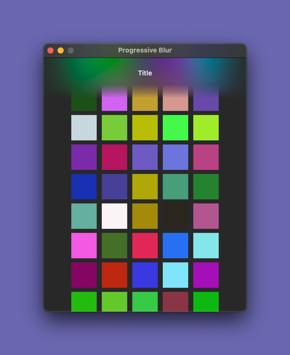

# Progressive Blur

This example project shows a simple way of achieving a progressive blur effect in a SwiftUI Mac app.
It uses a `NSVisualEffectView` (wrapped as a `NSViewRepresentable` for SwiftUI) in combination with the `.mask` view modifier and a linear gradient mask.

## License

Licensed under the MIT license. See [LICENSE](https://github.com/martinhoeller/swiftui-progressive-blur-example/blob/main/LICENSE) for details.
